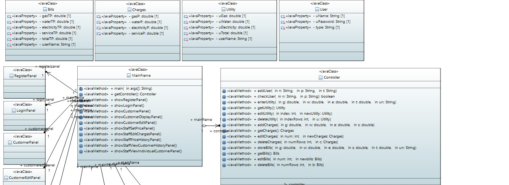
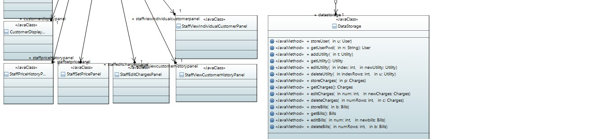
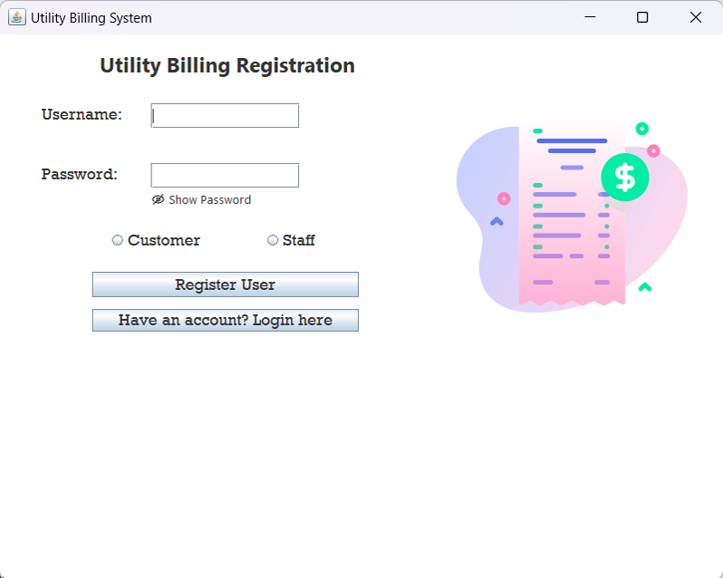
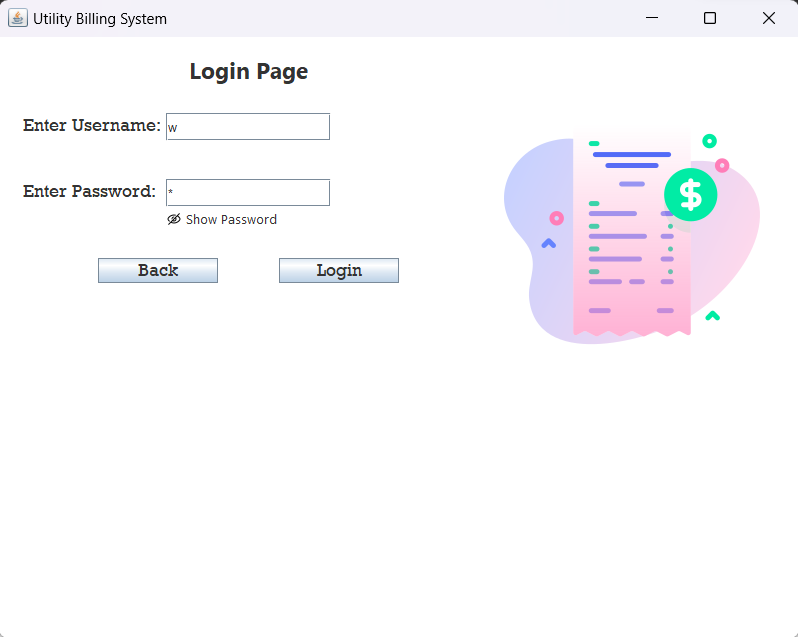

# Utility Billing System

### Project Scenario

PS Group is a utility company in Singapore that provides cooking gas, electricity, and water. To improve efficiency, the company has decided to introduce a utility billing program for its customers. The program will allow customers to submit their utility meter readings and receive actual bills based on their consumption. The utility billing program must also adhere to the MVC design model.

### Functions and Requirements

A user interface (UI) for customers to submit meter readings and view calculated bills, as well as UI for staff to create, read, update, and delete (CRUD) price charges. The program should implement customer components using user management to grant restricted access for staff to view customer bills.

### Personal Contributions

As part of a collaborative group project, I implemented the following features for the utility billing system:
- Story Boarded the UI flow to ensure consistency throughout the program, also created the class diagram that adheres to the MVC model.
- Developed the UI for staff, which includes the CRUD functions, also implemented user management restrictions to ensure that only authorized staff members can view customer bills.
- Added features to improve the user experience, such as the ability to view customer bill health status, and a staff feature called "set main" that allows staff to switch between different price charges.

### Class Diagram
 
 

### Register and Login
 
 
